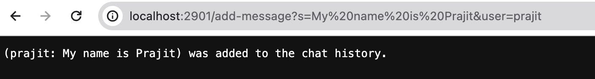
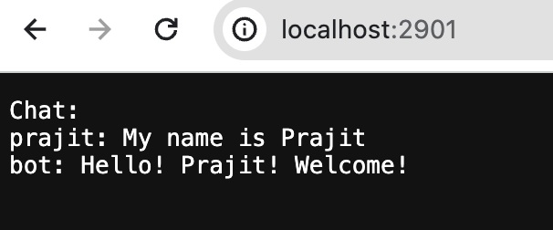
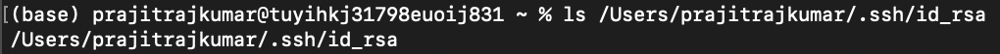
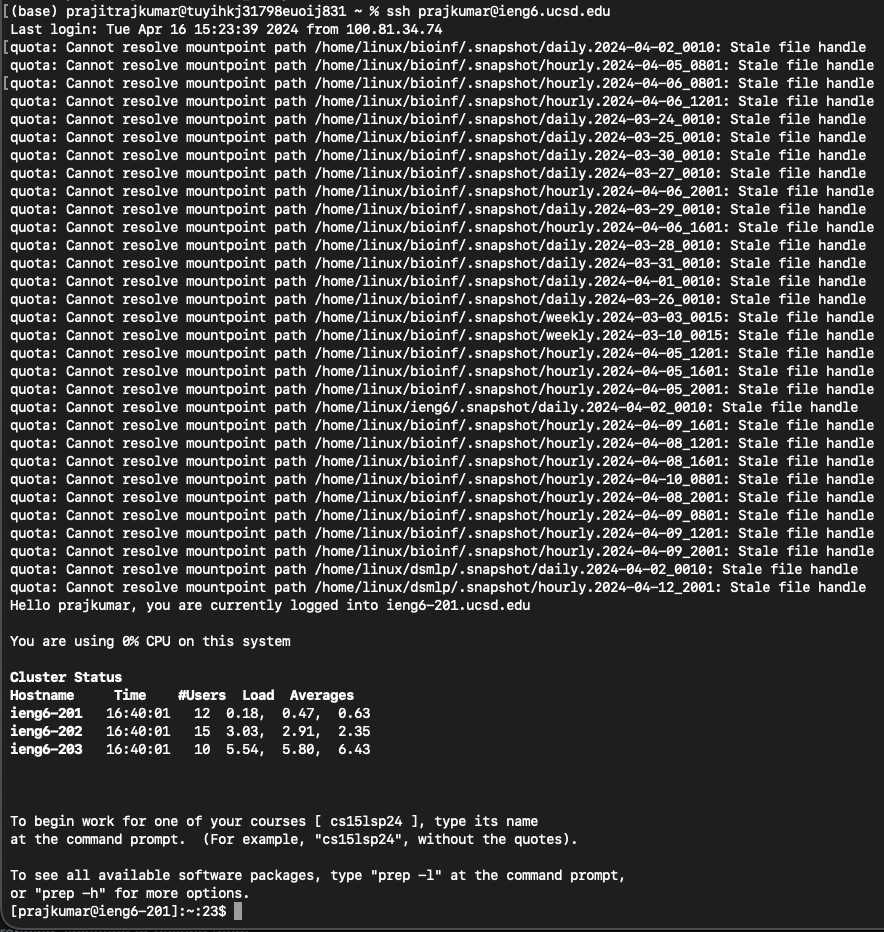
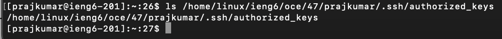

# Lab Report 2

## Part 1
Code for `Server.java` (obtained from `Server.java` from `wavelet` with permission from TA)
```
// Server code obtained from 
// https://github.com/ucsd-cse15l-s24/wavelet/blob/main/Server.java
// per instruction of TA

// A simple web server using Java's built-in HttpServer

// Examples from https://dzone.com/articles/simple-http-server-in-java 
// were useful references

import java.io.IOException;
import java.io.OutputStream;
import java.net.InetSocketAddress;
import java.net.URI;

import com.sun.net.httpserver.HttpExchange;
import com.sun.net.httpserver.HttpHandler;
import com.sun.net.httpserver.HttpServer;

interface URLHandler {
    String handleRequest(URI url);
}

class ServerHttpHandler implements HttpHandler {
    URLHandler handler;
    ServerHttpHandler(URLHandler handler) {
      this.handler = handler;
    }
    public void handle(final HttpExchange exchange) throws IOException {
        // form return body after being handled by program
        try {
            String ret = handler.handleRequest(exchange.getRequestURI());
            // form the return string and write it on the browser
            exchange.sendResponseHeaders(200, ret.getBytes().length);
            OutputStream os = exchange.getResponseBody();
            os.write(ret.getBytes());
            os.close();
        } catch(Exception e) {
            String response = e.toString();
            exchange.sendResponseHeaders(500, response.getBytes().length);
            OutputStream os = exchange.getResponseBody();
            os.write(response.getBytes());
            os.close();
        }
    }
}

public class Server {
    public static void start(int port, URLHandler handler) throws IOException {
        HttpServer server = HttpServer.create(new InetSocketAddress(port), 0);

        //create request entrypoint
        server.createContext("/", new ServerHttpHandler(handler));

        //start the server
        server.start();
        System.out.println("Server Started! If on your local computer, visit http://localhost:" + port + " to visit.");
    }
}
```
Code for `ChatServer.java` (modeled after `NumberServer.java` from `wavelet` with permission from TA)
```
// Server code modeled after 
// https://github.com/ucsd-cse15l-s24/wavelet/blob/main/NumberServer.java
// per instruction of TA

import java.io.IOException;
import java.net.URI;

class Handler implements URLHandler {
    // The one bit of state on the server: a number that will be manipulated by
    // various requests.
    String chat_history = "";

    public String handleRequest(URI url) {
        if (url.getPath().equals("/")) {
            return "Chat:\n" + chat_history;
        } else {
            if (url.getPath().contains("/add-message")) {
                String query = url.getQuery();
                if (query.contains("s=") && query.contains("&user=")) {
                    query = query.substring(2);
                    String[] chatStrings = query.split("&user=");
                    chat_history = (chat_history + chatStrings[1] + ": " 
                                    + chatStrings[0] 
                                    + "\n");
                    return ("(" + chatStrings[1] + ": " + chatStrings[0] 
                            + ") was added to the chat history.");
                }
            }
            return "404 Not Found!";
        }
    }
}

class ChatServer {
    public static void main(String[] args) throws IOException {
        if(args.length == 0){
            System.out.println("Missing port number! Try any number between 1024 to 49151");
            return;
        }

        int port = Integer.parseInt(args[0]);

        Server.start(port, new Handler());
    }
}
```

Screenshot 1:

1. 
2. 
3. 
Screenshot 2:

1.
2. 
3. 
Result:


## Part 2
Private Key (from local):

Public Key (from server):

Passwordless Login to Server:



## Part 3
