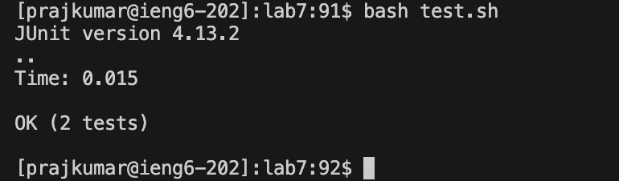

# Lab Report 4

# Step 4:
1. 
2. The keys that I pressed for step 4 were `ssh prajkumar@ieng6.ucsd.edu<enter>`.
3. This enabled me to run the `ssh` command in order to establish a connection to the `ieng6.ucsd.edu` server, which was possible because I previously set up SSH keys in Week 3 in order to log in without using a password.

# Step 5:
1. 
2. The keys that I pressed for step 5 were `git clone git@github.com:prajitrr/lab7.git<enter>`.
3. This enabled me to run `git clone` in order to clone the the repository named `lab7`, which was possible due to `ssh` setup I previously performed.

# Step 6:
1. 
2. I first pressed `cd lab7<enter>`. Then I pressed `ls<enter>`. After this, I pressed `bash test.sh<enter>`.
3. The first set of keypressed allowed me to navigate to the folder containing the `lab7` repository. Then, the next set allowed me to few the files in the directory. I then ran the `test.sh` script present within the repository in order to run tests by using the `bash` command, which sped up the testing process significantly.

# Step 7:
1. 
2. First, I pressed `vi ListExamples.java<enter>`. I then pressed `<up>` followed by `<right><right><right><right><right><right><right><right>`. After this, I pressed `i<delete>2` followed by `<esc>:wq<enter>`.
3. The first command allowed me to open the `ListExamples.java` file for editing using the `vim` text editor. I then navigated to the error to be fixed using the sequence of arrow keys. After this, hitting `i` allowed me to insert a change, followed by `<delete>` and then `2` to delete the number `1` and change it to `2`, fixing the bug. Then, I hit `<esc>` to exit the insertion mode followed by `:wq<enter>` to write my changes and quit the `vim` editor.

# Step 8:
1. 
2. I pressed `bash test.sh<enter>` for this step.
3. As in Step 6, this enabled me to run the `test.sh` script, which streamlines the testing process for running the tests on the `ListExamples.java` program.

# Step 9:
1. 
2. For this step, I first hit `git add ListExamples.java<enter>`. I then hit `git commit -m "Fixed bug"<enter>`. Finally, I pressed `git push<enter>`.
3. The first command allowed me to add `ListExamples.java` to stage its changes for committing them. Then, I committed my changes to the locally saved version of the repository using the second command. Finally, I pushed my changes to the repository on GitHub using `git push<enter>`.

