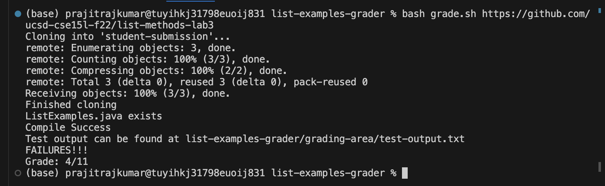
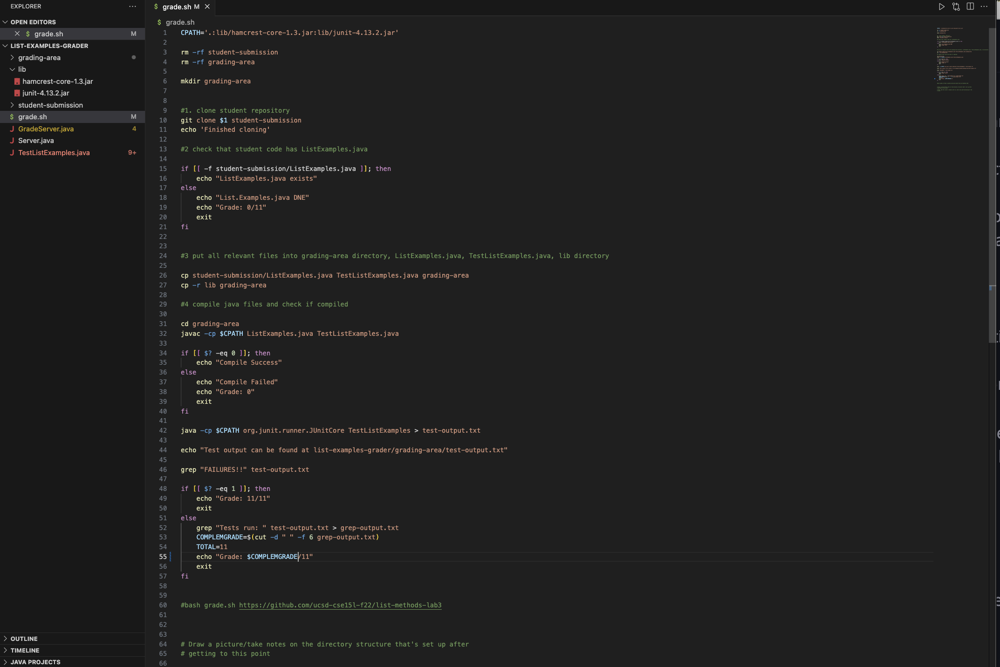
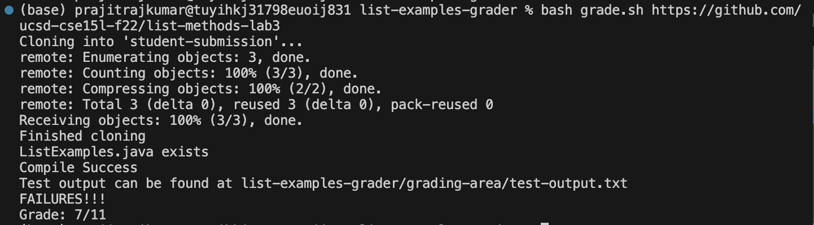
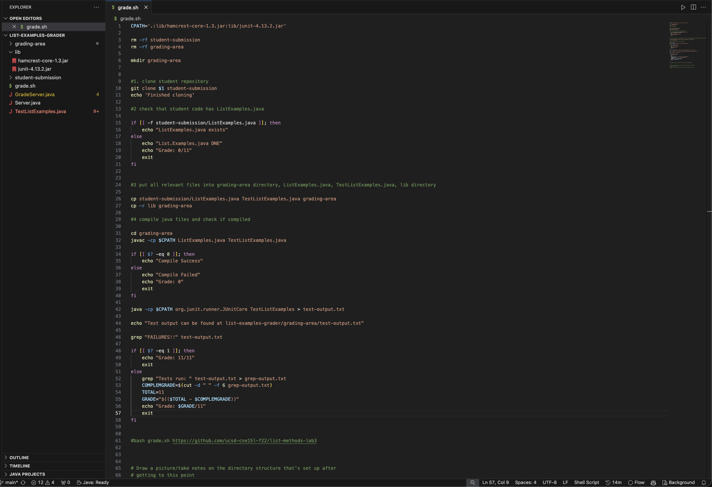

# Lab Report 5

## Part 1
### Initial Post:

Hello! I was recently trying to get my `grade.sh` script from Week 6 to work correctly. I have gotten to the point where when I run it on a repository that is fully correct, the result outputted is correct. However, when I run it on a repository with some incorrect code, the grade that is output is partial, but the numerical value of the grade is incorrect. It should be 7, but instead, it is 4. I think that the issue might have to do with converting the number I get from the output of the `TestListExamples.java` file to an actual score, but I'm not sure to be honest. I've attached screenshots of my code and the failure-inducing input.

### Response from a TA:
Hi Prajit! Let's take a look at your code. I think you might be on the right track, as when we add up the two numbers you mention, 7 and 4, we get 11, the total number of tests that you run, according to the screenshot you sent. Because you always know the total number of tests you run and the total number of tests that fail, do you think that you could use these values to get the number you want?

### Response Back from Student:

Thank you so much Prajit! You're right, I realized what the bug was; I should have subtracted the output of the number I get from `TestListExamples.java` from 11, and then this would be the number that I want, the number of tests that ran correctly. The bug was thus that I did not perform this operation, and I've done that in my code. This fixed the bug and got me the correct output. I've attached screenshots of what happened here. Thanks!

### Setup Information:
The setup was produced using the following steps.
1. Clone the `list-examples-grader` repository using `git clone https://github.com/scottinp/list-examples-grader`. This repository contains the working grade script that I wrote with my partner in Week 6. Change into the repository's directory using `cd list-examples-grader`.
2. Edit the file `grade.sh` and delete Line 55 of the file. Then, change the variable `$GRADE` in Line 56 of the file to `$COMPLEMGRADE`.

These are the only changes made to the code. The repository's file & directory structure remains the same compared to the original directory. The contents of each file also remain the same, with the only changes being described above.
The command that was run to trigger the bug was `bash grade.sh https://github.com/ucsd-cse15l-f22/list-methods-lab3`.
In order to fix the bug, an insertion needs to be made between Lines 54 and 55 of the buggy code. Within the `else` block, the statement `GRADE="$(($TOTAL - $COMPLEMGRADE))"` should be added. Then, the variable `$COMPLEMGRADE` in Line 56 of the edited file should be changed to `$GRADE`.

## Part 2
Something that I learned from my lab experience during the second half of this quarter was how versatile `bash` as a language is for general purpose tasks. Before this class, I did not realize how `bash` could be used in the same way as languages such as `Java` or `Python` for doing tasks as complicated as writing code for grading a wide range of inputs to assignments. I honestly thought that `bash` was really just a somewhat outdated way to navigate a computer using a keyboard only. Now, however, I know about how powerful it can be as a tool and how much faster it is to navigate through my computer using my keyboard rather than a GUI. I think that this was definitely really valuable to learn for me as I can now envision myself using it a lot more in my future.
